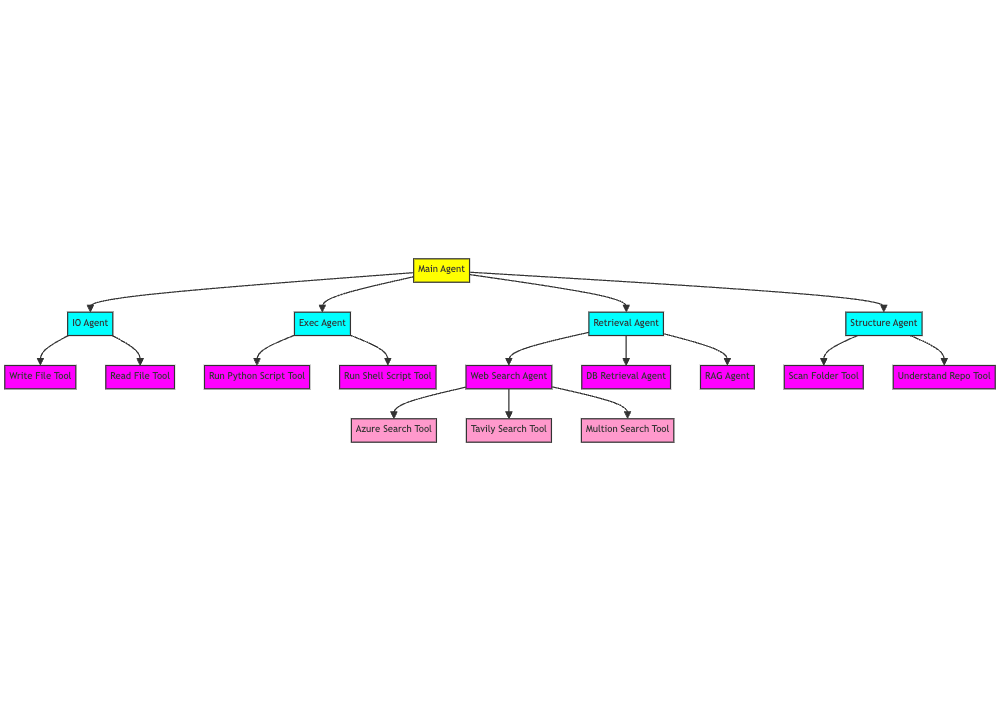

# LiteMultiAgent
repo owner: Danni (Danqing) Zhang (danqing.zhang.personal@gmail.com)

## 0724, Wednesday
* use llamaindex or langchain to support different llm
* use openai to call other llm
  * https://openrouter.ai/docs/quick-start

## 07/22, Monday
* multi-agent design
  * main agent
    * (1) io sub agent
    * (2) execution sub agent
    * (3) information retrieval sub agent (SyHeee)
      * database retrieval agent
      * <local file search sub agent>: RAG
      * web search sub agent
    * (4) login sub agent (Tata)
    * (5) structure sub agent
      * understand file directory
      * scan folder
* use case
  * (1) write new document based on template with customer information
    * (1) customer information: file 1
      * io sub agent
    * (2) template: file 2
      * io sub agent
    * (3) generation []
    * (4) output to the file 3
      * io sub agent
  * (2) customer database (name, customer information), customer name, template, new file
    * (1) db: retrieval
      * information, SQL
    * (2) template: file 2
      * io
    * (3) customer + template, file 3
      * io
* TODO: web search agent (SyHeee)
  * web search agent
    * find links, azure api
    * collect information: tavily, multion
    * summarization
      * langchain
      * XXX

## 07/18, Thursday
* multi agent review: https://github.com/Tata0703/AI_agents/tree/main/0719_SPC_multiagent

## 07/17, Wednesday
* MultiAgent work!
  * bring this to another level
  * +planning agent
  * +evaluation agent
* review all the frameworks

## 07/13, Saturday
* start doc on SPC presentation [todo]
* demo (MVP):
  * one main agent, where we use information collection agent as a tool
  * information collection agent, only has websearch tool

## 07/01, Monday
* findings
  * use case?
* multi-agent
  * social/ discussion。博弈: multi-agent
    * use case?
    * poker?
  * tool, workflow
    * XXX
    * llm，planning，workflow，tool
      * gpt-3.5
      * gpt-4o
* A, B
  * A, response
  * [A], ["instruction"] response
  * [A+instruction] response
  * DZ update the instruction[TODO]
* multi-agent use case
  * in group chat settings, let facilitator agent, to choose agent to answer questions
* single agent use case
  * continue without asking
    * option 1: system prompt "be as autonomous as possible"
    * option 2: a single agent can handle it, such as with self-reflection. Simply put, if there is no tool use, then maybe it should self-reflect/review and decide whether to continue or ask the user.
  * limit of one agent dealing with one task.
* system prompt
  * openai allows multiple system prompt
  * we can insert system message into the chat
  * use summarization of the recent 10 messages as system prompt

## 06/30, Sunday
* autogen code

## 06/29, Saturday
* one agent
  * understand langchain agent design
  * change tavily_search to return the complete result for the first page
* multi agents
  * evaluation metrics: effectiveness, efficiency
    * for example, if we pass more tools to one agent, that agents could finish a lot of tasks, but it is very costly since there are too many prompt tokens
  * one super agent, check opendevin [todo]
    * delegation
      * https://github.com/OpenDevin/OpenDevin/blob/874b4c90753f5297512c7cf28b82da7b7aa14edd/agenthub/delegator_agent/agent.py#L14
      * study
      * coder
      * verifier
* fake multi-agent use case
  * coding: programming, testing, execution, debugging
* real multi-agent use case
  * group chat: https://github.com/microsoft/autogen/blob/main/notebook/agentchat_groupchat.ipynb, https://github.com/microsoft/FLAML/blob/4ea686af5c3e8ff24d9076a7a626c8b28ab5b1d7/notebook/autogen_multiagent_roleplay_chat.ipynb
    * different agent framework?
    * different llm
    * different tools
      * one could use search tools
    * sequence? for loop?
      * A, B, C
* topics
  * what are the real multi-agent use case?
  * if one agent can handle one task already, why multi agent?
    * use fewer tools, fewer prompt tokens, cheaper
    * shorter message list
    * better success rate?
* different settings
  * use case specific agent:
    * define workflow for specific scenario, different agents work for different part of the work
      * example: one research agent, one production agent
      * use case: very specific use case
  * general agent:
    * a general agent but really work hard on the prompting
      * so it can make plan really well
    * a general agent chooses workflow, in each workflow there are different agents working together
      * the general agent is essentially doing the planning
        * but instead of planning by itself, it chooses from existing workflows
          * in each flow, the tool interaction is perfectly defined already!
        * currently if you ask LLM to make a plan, it couldn't utilize existing tools efficently in the planning stage
          * so sometimes, it's plan is not that good, takes more time and money
        * if it's really common-sense, maybe LLM can already do that
      * memory and tool
        * for each task, the general agent
          * only takes the final output of each step
          * if there are multiple steps
            * no need to append each step to the message list of the general agent
          * if in each step, the agent is calling multiple tools
            * no need to use the toolcall and toolresponse message
    * a general agent, whose use a list of agents as tools
      * example: one research agent that research different sources
      * memory and tool